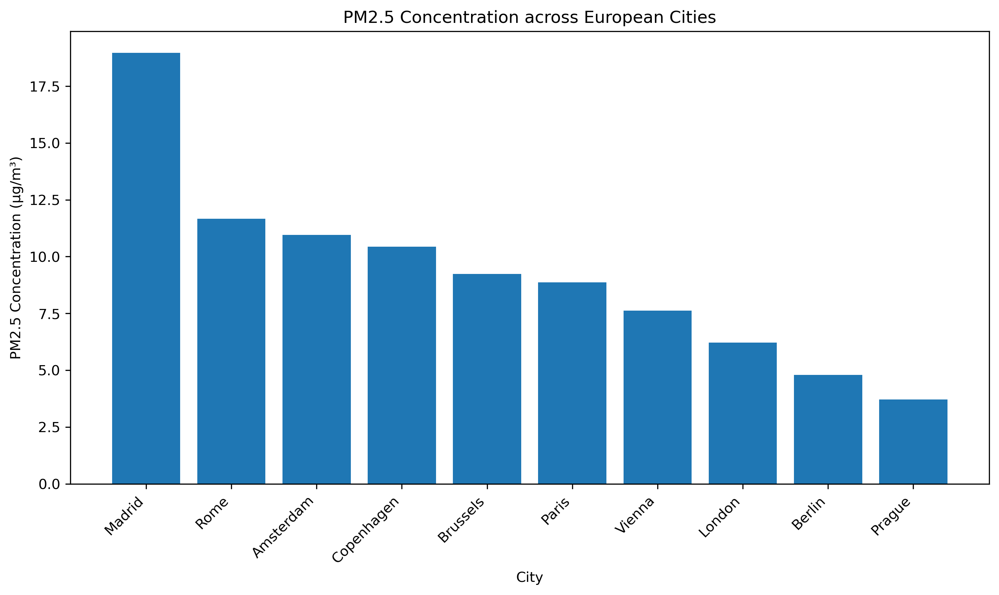
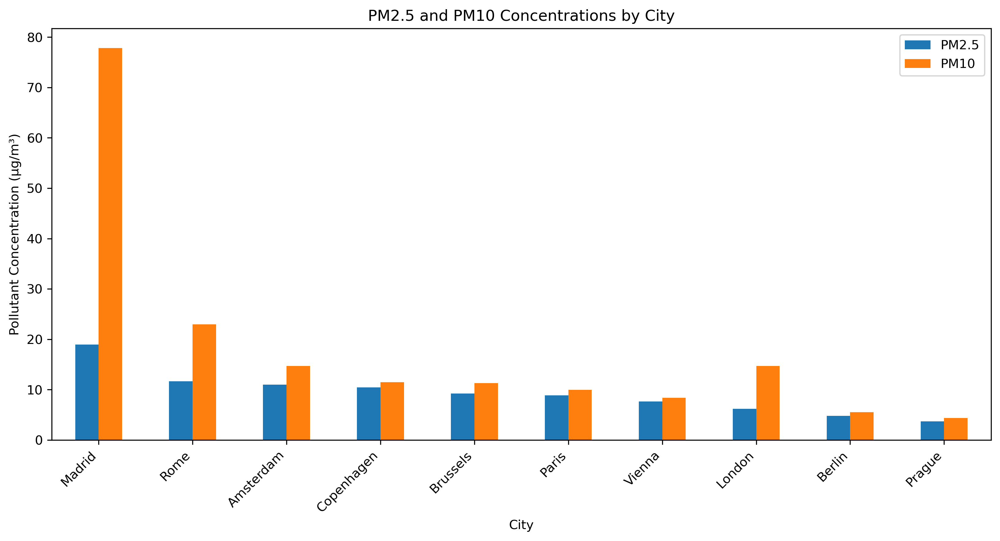
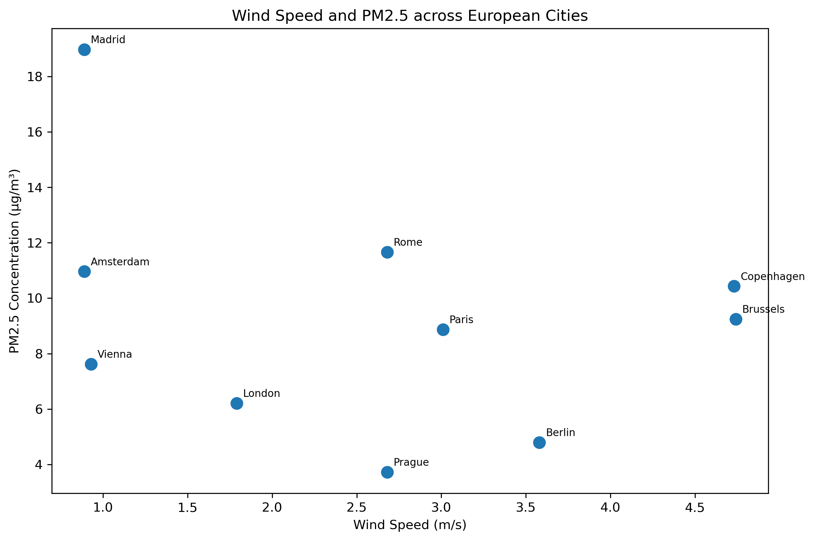
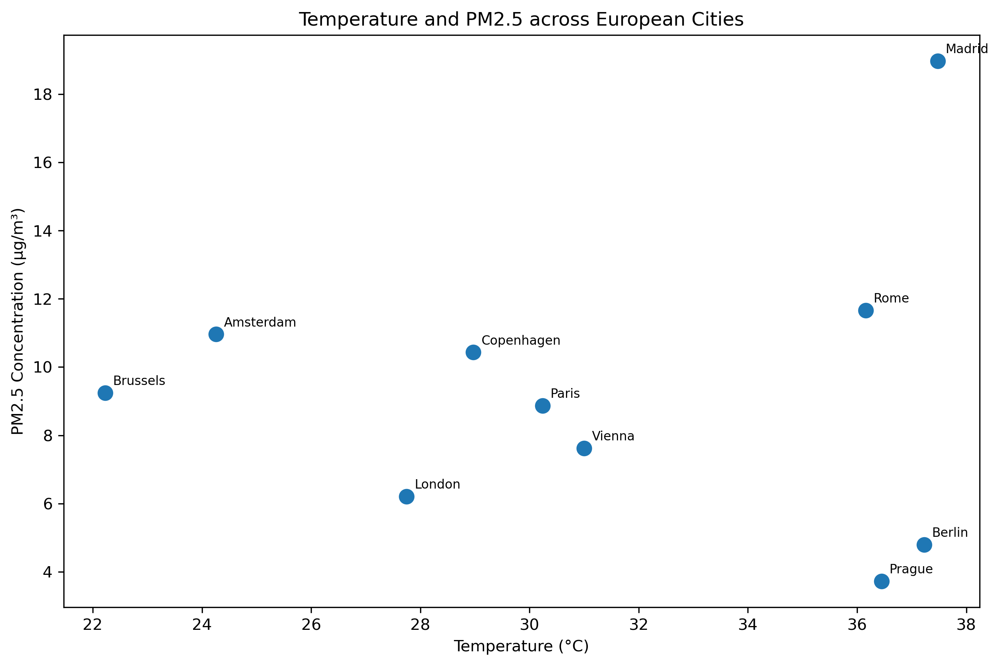
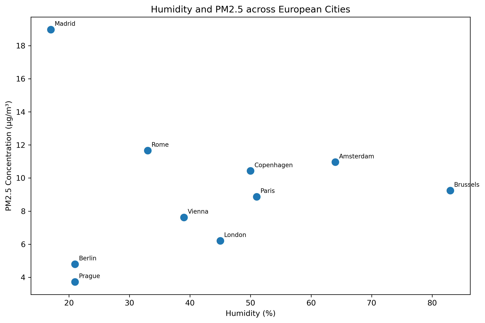

# ME204 Project

# European Air Quality and Weather

## How does air quality vary across major European cities, and which weather conditions are associated with worse pollution?

Welcome to my ME204 final project website.

This project investigates differences in air quality across ten major European cities using data collected from the OpenWeather API. It compares pollution measurements with weather conditions to explore whether variables such as temperature, humidity, and wind speed are associated with air quality.

---

## Project Overview

The cities included in this project are:

- London
- Paris
- Berlin
- Madrid
- Rome
- Amsterdam
- Brussels
- Vienna
- Copenhagen
- Prague

For each city, the following data was collected:

- Air Quality Index (AQI)
- PM2.5 concentration
- PM10 concentration
- Nitrogen dioxide (NO₂)
- Ozone (O₃)
- Carbon monoxide (CO)
- Temperature
- Humidity
- Atmospheric pressure
- Wind speed

The data represents a snapshot collected at one point in time.

---

# Finding 1: Air quality varied across cities

Madrid recorded the highest PM2.5 concentration in the dataset at **18.97 µg/m³**, while Prague recorded the lowest concentration at **3.72 µg/m³**.

Although many cities were classified in the same **Moderate** AQI category, their PM2.5 concentrations differed considerably. This demonstrates that individual pollutant measurements provide a more detailed comparison than the AQI category alone.

---

# Finding 2: Madrid had the highest particle pollution

Madrid also recorded the highest PM10 concentration at **77.85 µg/m³**, considerably higher than the other cities in the dataset.

Rome had the second-highest PM2.5 concentration, followed by Amsterdam and Copenhagen.

Comparing PM2.5 and PM10 together shows that cities with higher fine-particle pollution generally also had higher levels of larger airborne particles.

---

# Finding 3: Weather showed only weak relationships with pollution

The analysis explored whether weather conditions were associated with PM2.5 concentrations.

Wind speed showed a weak negative relationship with PM2.5, suggesting that cities with stronger winds tended to have slightly lower pollution levels during the time of collection.

Temperature and humidity showed little or no clear relationship with PM2.5 in this sample.

### Wind Speed and PM2.5

### Temperature and PM2.5

### Humidity and PM2.5

---

# Overall Conclusion

This project found clear differences in air quality across the selected European cities.

Madrid recorded the highest PM2.5 and PM10 concentrations, while Prague and Berlin had the lowest PM2.5 values.

Weather conditions explained only a small amount of the variation in pollution. Wind speed showed a weak negative association with PM2.5, while temperature and humidity showed little relationship. These findings suggest that other factors, such as traffic, industry, geography, and local emissions, are likely to play a larger role in determining air quality.

---

# Limitations

The project uses one observation from each city, so the results represent a snapshot rather than long-term averages.

Air quality changes throughout the day and across seasons. Future work could collect repeated observations over several days or weeks to produce a more comprehensive analysis.

---

# Tools Used

This project was completed using:

- Python
- OpenWeather API
- Requests
- JSON
- pandas
- Matplotlib
- Git
- GitHub
- GitHub Pages

---

## Repository

The complete source code, notebooks, processed data, and documentation are available in this project's GitHub repository.

- [tessdavies55](./tessdavies55.md)
